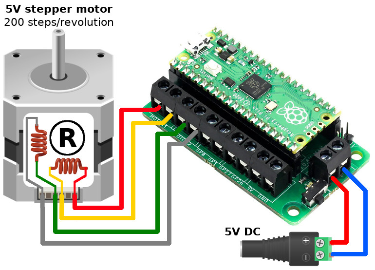

Other languages: [FRANCAIS](README_FR.md)

# Kitronik-Pico-Motor-Driver-Board-MicroPython


A class and sample code to use the Kitronik Motor driver board for Raspberry Pi Pico. (www.kitronik.co.uk/5331)

This is the __MicroPython version__. Pour CircuitPython [voir ici](https://github.com/KitronikLtd/Kitronik-Pico-Motor-Driver-Board-CircuitPython)

To use save `PicoMotorDriver.py` file onto the Pico so it can be imported

## Import the library and construct an instance

``` python
import PicoMotorDriver
board = PicoMotorDriver.KitronikPicoMotor()
```

This will setup the correct pins to drive the motors.

## Drive a motor:


```python
board.motorOn(motor, direction, speed)
```
where:
* __motor__ => 1 or 2
* __direction__ => f or r
* __speed__ => 0 to 100

The following example drives the both motors in opposite direction.

``` python
import PicoMotorDriver
board = PicoMotorDriver.KitronikPicoMotor()
board.motorOn(1, 'f', 100)
board.motorOn(2, 'r', 50) # turning slower
```
See also the following example scripts:
* [SingleMotorTest.py](SingleMotorTest.py): Driving one motor at the time (in both direction with speed increase/decrease) script.
* [AllMotorTest.py](AllMotorTest.py): test various combination of speed for the both motor (like on a 2 wheels robot).
## Stop a motor:

``` python
board.motorOff(motor)
```

where:
* __motor__ => 1 or 2

## Drive a Stepper:



### Rotating in steps

``` python
board.step(direction,steps)
```

where:
* __direction__ => f or r
* __steps__ => how many steps to make

See also the [StepperTest.py](StepperTest.py) example script.

### Rotating an angle
``` python
board.stepAngle(direction, angle)
```
where
* __direction__ => f or r
* __angle__ => how many degrees to move

### Default parameters

The stepper code assumes 200 steps per revolution (1.8 degrees per step) and only does full steps.

There are defaulted parameters for
* stepper speeds: default 20mS pause between steps,
* hold position when finished stepping: off - saves energy
* how many steps per rev: 200.
Look at the function headers and function comments in [PicoMotorDriver.py](PicoMotorDriver.py) for more detail if you need to change them.

# Troubleshooting

This code is designed to be used as a module. See: https://kitronik.co.uk/blogs/resources/modules-micro-python-and-the-raspberry-pi-pico for more information
