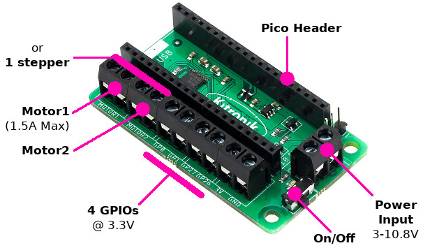
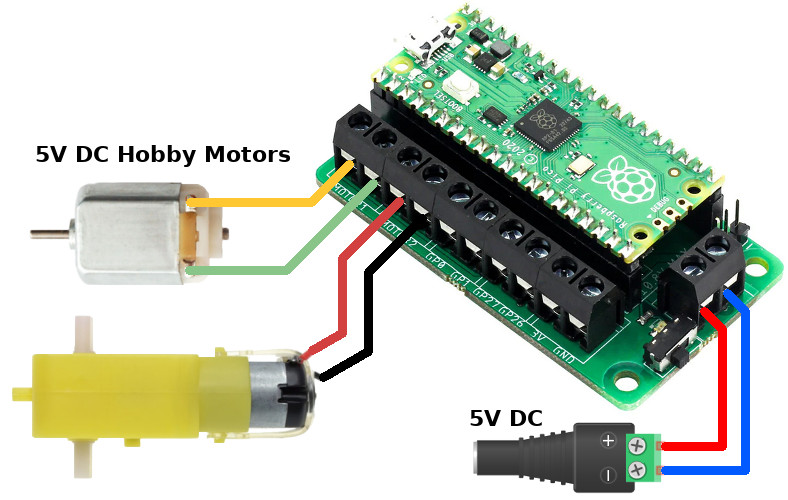
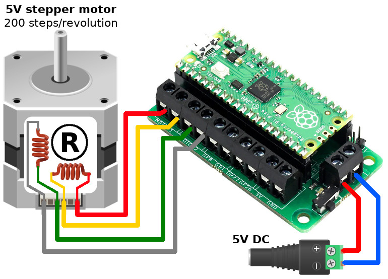

# Kitronik-Pico-Motor-Driver-Board-MicroPython
__Crédit:__ le fichier [README](README.md) est traduit par [MCHobby](https://shop.mchobby.be) - the [README](README.md) file is translated by [MCHobby](https://shop.mchobby.be)




Une classe et code d'exemple pour utiliser la carte Kitronik Motor driver pour Raspberry Pi Pico. (www.kitronik.co.uk/5331)

Ce README est une __version MicroPython__. Pour Circuit Python [voir ici](https://github.com/KitronikLtd/Kitronik-Pico-Motor-Driver-Board-CircuitPython)

Avant usage, copiez le fichier `PicoMotorDriver.py` sur votre Pico pour qu'il puisse être importé

## Importer la bibliothèque et créer une instance

``` python
import PicoMotorDriver
board = PicoMotorDriver.KitronikPicoMotor()
```

Cela initialise correctement les broches nécessaires pour piloter des moteurs.

## Piloter un moteur:



```python
board.motorOn(motor, direction, speed)
```
Où:
* __motor__ => 1 ou 2. Le moteur à commander.
* __direction__ => f ou r. Sens de rotation, "f" pour sens horlogique/avant (_forward_) et "r" pour le sens anti-horlogique/arrière (_reverse_).
* __speed__ => 0 à 100. Fixe la vitesse vitesse de rotation (entre 0 et 100%).

L'exemple suivant contrôle les deux moteurs en sens opposés.

``` python
import PicoMotorDriver
board = PicoMotorDriver.KitronikPicoMotor()
board.motorOn(1, 'f', 100)
board.motorOn(2, 'r', 50) # tourne plus lentement
```
Voir également les scripts d'exemples suivants:
* [SingleMotorTest.py](SingleMotorTest.py): contrôle un moteur à la fois (dans les deux sens avec accroissement/réduction de la vitesse).
* [AllMotorTest.py](AllMotorTest.py): teste différentes combinaisons de vitesses des deux moteurs (comme sur un robot deux roues).
## Arrêter un moteur:

``` python
board.motorOff(motor)
```

Où:
* __motor__ => 1 ou 2. Le moteur à commander.

## Contrôler un moteur pas-à-pas:



### Rotation en pas

``` python
board.step(direction,steps)
```

Où:
* __direction__ => f ou r. Sens de rotation, "f" pour sens horlogique/avant (_forward_) et "r" pour le sens anti-horlogique/arrière (_reverse_).
* __steps__ => nombre de pas à réaliser.

Voir aussi le script d'exemple [StepperTest.py](StepperTest.py) .

### Rotation en angle
``` python
board.stepAngle(direction, angle)
```
Où:
* __direction__ => f ou r. Sens de rotation, "f" pour sens horlogique/avant (_forward_) et "r" pour le sens anti-horlogique/arrière (_reverse_).
* __angle__ => le nombre de degrés de rotation.

### Paramètres par défaut

Le code considère qu'il s'agit d'un moteur avec 200 pas par rotation (soit 1.8 degrés par pas) et exploite exclusivement le mode "_full step_" (pas entier).

Voici le paramétrage par défaut
* vitesse pas-à-pas: 20 ms pause entre les pas par défaut,
* maintient de la position (_hold_) après la rotation: désactivé - économise de l'énergie
* Nombre de pas par révolution: 200.

Voyez l'entête des fonction et commentaires dans  [PicoMotorDriver.py](PicoMotorDriver.py) pour plus d'information si vous avez besoin de les modifier.

# Dépannage

Le code est conçu pour être utilisé comme un module. Voir [modules micropython and the raspberry-pi pico](https://kitronik.co.uk/blogs/resources/modules-micro-python-and-the-raspberry-pi-pico) (_Blog Kitronikn Anglais_) pour plus d'informations.
